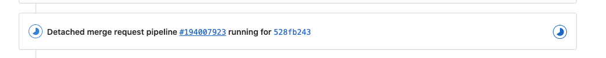

In this exercise, we are going to enable CI on our repository.

To do this, we are first going to create a new feature branch on our
repo. We will then commit the CI jobs and push this to our feature
branch.

Following this, we will create a Merge Request to the **test** branch,
to test the CI on our **test** environment. A Merge Request is a Gitlab
feature that allows us to compare the changes between two branches
before merging the source branch into the destination branch.

Out the box, Merge Requests allow us to view the changes between two
branches, but can be extended through CICD Merge Request jobs which we
will be introducing in this tutorial.

.gitlab.ci.yml
==============

Gitlab CI jobs are configured using a file named **.gitlab-ci.yml**
which is stored at the root of the repository. An example file can be
found at **.gitlab-ci.yml.example.**

This file does the following:

-   Create the CICD stages

-   Set up the CICD variables

-   Imports individual CICD jobs from the **ci** directory in the
    repository

We will cover the remaining three CICD files in the next exercise.

Gitlab CICD works via performing what are called jobs. Jobs run on a
Docker container, and perform script actions which we tell the job to
run.

Jobs are organised into stages, where all jobs in a stage are executed
in parallel. Stages allow us to define the workflow of the CICD
pipeline. In our case, the pipeline stages look like this:

-   Test

-   Merge-request

-   Deploy

-   Deploy-static

-   Destroy

Variables

These variables are shared across each of the CICD jobs.

CI files

We use the Gitlab CI "include" command to include individual pipeline
definition files which we have stored in the ci directory in the root of
the repository.

Create feature branch
=====================

We will now create a new branch to make our changes in.

Create a new branch by navigating to **Repository \> Branches** in the
left menu

Click **New branch**

Name your branch **enable-ci** and leave Create from set to **master**
so we create a copy of our master branch. Click **Create branch**

We will now be taken to our branch in the Repository view. Click on the
**Web IDE** button to enter Gitlab's Web IDE. This is how we will be
making and committing changes.

Click on **.gitlab-ci.yml.example** to edit the CI definition file

Go ahead and change "changeme" to your own name, but make sure to just
use alphabetical characters (e.g Cameron Harper \> cameronharper)

Now we need to rename the file from **.gitlab-ci.yml.example** to
**.gitlab-ci.yml** so that Gitlab will start to initialise our CICD
pipelines.

Hover over **.gitlab-ci.yml.example** in the left sidebar and you should
see a menu. Click this then click **Rename/Move**

Enter **.gitlab-ci.yml** and click **Rename file**

Click **Commit** to begin to commit our changes

Give your commit a meaningful message like above, and untick the **Start
a new merge request** box. We will create our Merge Request manually.
Click **Commit** to commit our changes to the enable-ci branch.

Now close the Web IDE by clicking on your repository title in the top
left corner

Create merge request
====================

We should now be taken back to the main Repository view. There will now
be a button in the top left **Create merge request** for our branch
enable-ci. Click this.

Change the branches by clicking **Change Branches**

Select **test** as our target branch and click **Compare branches and
continue**

Untick the box **Delete source branch when merge request is accepted**
as we want to merge our source branch to master after we have tested it.
Click **Submit merge request** at the bottom of the page.

We will now be taken to our created Merge Request. A "Detached merge
request pipeline" will now be created, running the merge-request stage
of our CICD pipeline.

We can click on the pipeline ID to go to the pipeline.

Merge Pipelines
===============

Click on each of the jobs listed under **Merge-request** to view them.

Merge:lint-terraform

This job runs a tool called **tflint** on our Terraform code base. A
Junit formatted test report is created which will be attached to the
Merge Request. There shouldn't be anything of interest created from this
job until we get to the later exercises.

Merge:plan-infra

Terraform, our deployment tool, allows us to create a plan of the
deployment before we perform it.

Terraform is looking through each of the .tf files in the infra
directory and generating a plan of what these should look like when
deployed to AWS. If we had already ran a deployment, Terraform would
also be analysing the current state of those deployed resources and
comparing it to the expected state. This allows Terraform to detect any
"**drift**" between the actual and expected states.

The plan produced is then translated to JSON, so that it can be attached
to the Merge Request as a Terraform report.

This report outlines the changes that will be performed when the plan is
deployed.

Click on the **View full log** button to view the full details of what
is planned to be deployed.

[[Repository]{.ul}](https://gitlab.com/dpg-gitops/dpg-gitops-test/-/tree/master)

Have a review of the items listed in the log. These will all be created
when Terraform is run with the **apply** command.
