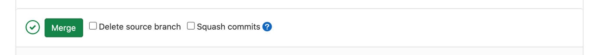

Now that we have reviewed our Merge Request, we can merge this to our Test branch.
----------------------------------------------------------------------------------

1.  To do this, click the **Merge** button on the Merge Request page

This will trigger a deployment job to the testing environment. Click on
the link next to **Pipeline** to view the deployment pipeline.

Deploy Infra
============

This job performs a **terraform apply** on the plan we produced when we
created the Merge Requests. This action will go and apply the changes
required to our infrastructure.

1.  Click **deploy:infra-test** to view the job details

If you look at the **Job logs** you should see the actions Terraform is
performing

Once Terraform has finished the deployment, a list of outputs is
displayed on the Job log, highlighted in green text.

2.  Copy the **domain_content** value (similar to
    dpg-gitops-cmhrpr-test-static-content.s3.amazonaws.com). We will use
    this to access our application.

Deploy Static
=============

Once the Terraform deployment is complete, a static content deployment
is triggered. This copies the static user interface files from the
**static** **directory** at the root of the repository to an S3 bucket
which is created by the infrastructure deployment.

The name of the S3 bucket is copied between the infrastructure
deployment job to the static deployment job via a file called
**STATIC_BUCKET.env**. This sets an environment variable called
**STATIC_BUCKET**, which will be used as our copy destination.

Once the static deployment is complete, we can access our application.

Access
======

Using the URL copied above we can access our application. We need to
prepend the HTTPS prefix (https://) and add /index.html to the end of
our URL.

Example:

<https://dpg-gitops-cmhrpr-test-static-content.s3.amazonaws.com/index.html>

Enter the URL into your browser and you should be able to see your
application.

**You can now move on to the final exercise 005-exercises!**
